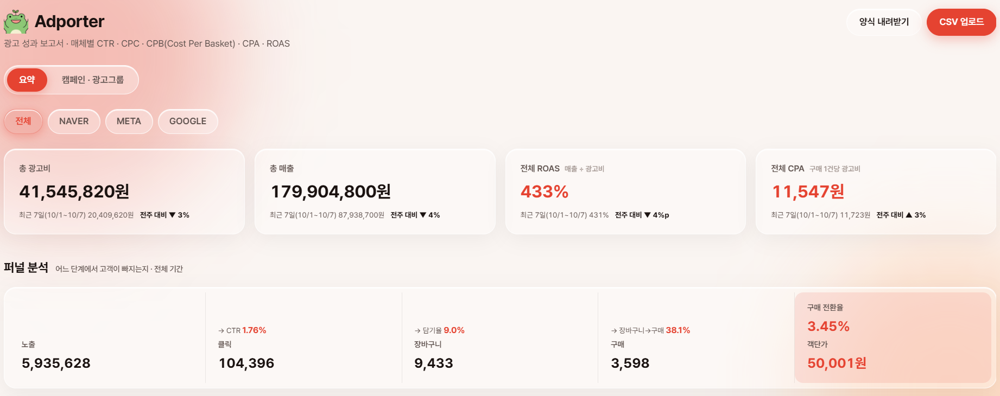

# Adporter · 광고 성과 보고서

네이버 · 메타 · 구글 광고 성과 데이터를 매일 CSV로 쌓고, **CTR · CPC · CPB · CPA · ROAS** 를 자동 계산해 보여 주는 그로스 마케팅 대시보드입니다.

- **배포 주소**: https://test1007-frontend-rri4.vercel.app
- 백엔드는 무료 서버라 15분간 요청이 없으면 잠듭니다. 첫 접속 시 30초 ~ 1분 정도 걸릴 수 있어요.

## 화면



## 주요 기능

### 요약 페이지 `/`
- **합계 카드**: 총 광고비 · 총 매출 · 전체 ROAS · 전체 CPA (구매 1건당 광고비) + **최근 7일 · 전주 대비**
- **퍼널 분석**: 노출 → 클릭 → 장바구니 → 구매 단계별 비율(CTR · 장바구니 담기율 · 장바구니→구매율 · 구매 전환율 · 객단가), 매체별 비교에서 가장 낮은 단계에 "최저" 표시 → 병목 찾기
- **일자별 성과 추이**: 최근 14일 CPA · ROAS 선 그래프
- **월 누적 성과 추이**: 최근 3개월 CPA · ROAS 그래프 + 전월 대비(▲▼)
- **월 누적 / 일자별 성과 데이터 표**
- 매체 필터 (전체 / NAVER / META / GOOGLE)

### 캠페인 · 광고그룹 페이지 `/campaigns`
- 캠페인별 성과 표 → 캠페인을 누르면 광고그룹별 성과가 펼쳐짐
- **소재 인사이트**: ROAS 상위 5 (예산 확대 후보) · 하위 5 (교체 후보), 광고비를 썼는데 전환이 0인 소재 경고. 광고비 10만 원 미만 소재는 우연히 튀는 값을 막기 위해 순위에서 제외
- 로우 데이터 표: 한 줄씩 직접 추가 · 수정 · 삭제
- 매체 + 기간 필터 (전체 / 최근 7일 / 최근 14일 / 직접 선택)

### CSV 업로드
- 정해진 양식(한글 제목 줄)의 CSV 를 올리면 한 번에 저장
- 엑셀 기본 저장(CP949)과 UTF-8 모두 한글이 깨지지 않음
- `100,000` · `1,000원` · `2026/10/1` · `네이버` 같은 엑셀식 값도 인식
- 한 줄이라도 틀리면 **전부 저장하지 않고** 줄 번호와 함께 오류 안내
- 날짜 · 매체 · 캠페인 · 광고그룹 · 소재가 같으면 **덮어쓰기** → 매일 누적 업로드해도 중복이 생기지 않음

## 지표 계산 규칙

| 지표 | 공식 | 표시 |
|---|---|---|
| CTR | 클릭 ÷ 노출 | `2.35%` |
| CPC | 광고비 ÷ 클릭 | `1,234원` |
| CPB (Cost Per Basket) | 광고비 ÷ 장바구니 | `1,234원` |
| CPA | 광고비 ÷ 전환 | `1,234원` |
| ROAS | 매출 ÷ 광고비 | `350%` |

- 지표는 **DB에 저장하지 않고** 화면에서 계산합니다. 원본 숫자를 고치면 지표가 자동으로 맞춰집니다.
- **분모가 0이면 `-`** 로 표시합니다. (`NaN`, `Infinity` 노출 없음)
- 합계 · 일별 · 월별 지표는 **합계끼리 나눕니다.** 예) 전체 ROAS = 총 매출 ÷ 총 광고비 (행별 ROAS 평균이 아님)
- 데이터가 없는 날은 그래프에서 0이 아니라 **빈칸**으로 둡니다. (0%로 폭락한 것처럼 보이지 않도록)

## 기술 스택

| 영역 | 기술 | 배포 |
|---|---|---|
| 프론트엔드 | React 19, Vite, React Router, Recharts, PapaParse | Vercel |
| 백엔드 | Spring Boot 4, Java 21, Spring Data JPA | Render |
| DB | MySQL 8 | Aiven |

```
브라우저 ──▶ Vercel (React) ──API──▶ Render (Spring Boot) ──▶ Aiven (MySQL)
```

## API

| 메서드 | 경로 | 설명 |
|---|---|---|
| GET | `/api/reports` | 목록 (최신 날짜순) |
| POST | `/api/reports` | 한 줄 추가 (중복이면 409) |
| POST | `/api/reports/bulk` | CSV 일괄 등록 (덮어쓰기, 전부 성공 또는 전부 실패) |
| PUT | `/api/reports/{id}` | 수정 |
| DELETE | `/api/reports/{id}` | 삭제 |

## 로컬 실행

필요한 것: Java 21, Node.js 20 이상, MySQL 8

```bash
# 1. 백엔드: backend/.env.example 을 복사해 backend/.env 를 만들고 DB 접속 정보 입력
cd backend
./gradlew bootRun          # http://localhost:8080 (테이블은 시작 시 자동 생성)

# 2. 프론트엔드: frontend/.env.example 을 복사해 frontend/.env 를 만들고 VITE_API_BASE_URL 입력
cd frontend
npm install
npm run dev                # http://localhost:5173
```

샘플 데이터: `sample-data/sample_reports_14days.csv` (3개 매체 × 14일) 를 화면의 **CSV 업로드** 로 올리면 됩니다.

### 테스트

```bash
cd frontend && npm test     # 지표 계산 · CSV 검사 테스트
cd backend && ./gradlew test
```

## 환경변수

| 위치 | 이름 | 설명 |
|---|---|---|
| 백엔드 | `SPRING_DATASOURCE_URL` | 예: `jdbc:mysql://<host>:<port>/<db>?sslMode=REQUIRED` |
| 백엔드 | `SPRING_DATASOURCE_USERNAME` / `SPRING_DATASOURCE_PASSWORD` | DB 계정 |
| 백엔드 | `CORS_ALLOWED_ORIGINS` | 프론트엔드 주소 (쉼표로 여러 개) |
| 프론트엔드 | `VITE_API_BASE_URL` | 백엔드 주소 |

비밀번호 등 접속 정보는 코드에 넣지 않고 환경변수로만 관리합니다. `.env` 는 git 에 올리지 않습니다.
